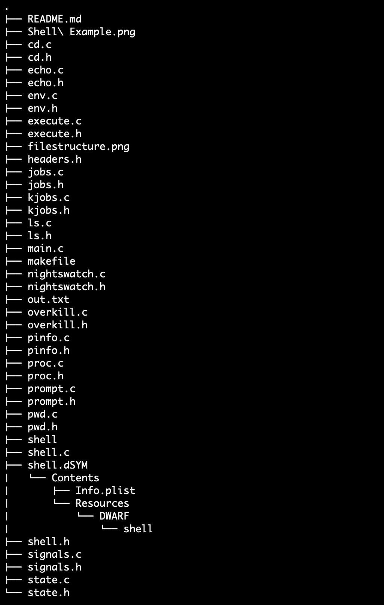

## Linux Shell using C Programming Language

### Structure

The file main.c contains the main body of a `Linux Shell` implemented in `C`. It displays the `hostname`, `username` and `current directory` similar to the way a regular shell does. It also has support for `~`, substituting it for the home directory. In this case, the home directory is the directory the shell files are stored in. All the headers are stored in the `headers.h` file along with individual files for every command.

### Running the shell:

```bash
$ cd <c-shell>
$ make
$ ./shell
```
To exit, type `quit` in the shell prompt.

The shell functions exactly like a normal terminal would, and if the code has been downloaded and executed successfully, it should look like this:


### File Structure

Each command is stored in a unique file along with its functionality, while the main program runs in the `main.c` file.



### Functions:

- The shell displays the `host name` and the `user name` formatted the way these details are shown in an ordinary shell.

- `pwd:` The `pwd` command displays the present working directory using the `getcwd()` function, from the file `pwd.c`.

- `cd:` The cd command by itself does nothing, however given an argument it changes the directory to the one specified in the argument, using `chdir`, from the file `cd.c`. It also supports `., .., - and ~` as arguments for `cd`. `cd -` changes to the previous working directory.

- `echo:` The echo command prints it's arguments on the terminal using simple print statement, from the `echo.c` file. When used by itself, echo returns a blank line.

- `ls:` The `ls` command supports flags `-l`, `-a` and combinations of the two. It displays the directories and files along with their details, from `ls.c`. With zero arguments, `.` or `~`, it displays for the current directory. With `..` it displays for the parent directory. Given multiple arguments, it displays the name and the contents sequentially using struct dirent and struct stat to get the requisite information.

- `pinfo:` Pinfo is a command not shown in a regular shell, but for the purposes of this one, it displays the process information such as process id, virtual memory used, executable path and status using `/proc/[pid]/stat` and `/proc/[pid]/exe` files, from the `pinfo.c` file. Given a process id it displays the information for that id, otherwise it displays information for the process id of the shell.

- Additional Processes: The shell also supports running both background and foreground processes differentiated by the character `&`. When background processes cease running, the program displays the name and process id of the terminating process, from the `proc.c` and `execute.c` files. 2 arrays `jobnames` and `jobpid` store the names and process ids of ongoing background processes. Whenever a process terminates, the termination is detected using signal(`SIGCHLD`, ()) and then stopped. It is also removed from the `jobnames` and `jobpid` arrays after displaying exit information.

- `nightswatch:` The nightswatch command uses a default interval of 5 seconds, but can also take an input of interval followed by the -n flag. Given the argument interrupt, this command displays the keyboard interrupts (i8042) every n seconds, and when the user presses q + Enter, it stops and resumes regular shell functions, from the nightswatch.c file. The information is obtained from the /proc/interrupts file. Non-blocking input is taken using fcntl | O_NONBLOCK. 

- `quit:` The quit command is used to exit the shell. It takes no additional parameters and occurs within the file main.c.

- `kjob:` this command takes a pid as a value and kills that process.

- The shell also supports `piping`, `redirection` and any combination of the two using `>, <, >> and |`. This is done using the `dup2` and `pipe` commands from c.

- The shell supports signal handling using `CTRL+C` to terminate a foreground process and `CTRL+Z` to send it to the background in a suspended state sending `SIGINT` and `SIGTSTP` signals respectively.

- The `jobs` command displays all the background jobs in the shell.

- The `overkill` command kills all current background jobs in the shell.

- `bg` and `fg` commands bring a foreground process to background and a background process to foreground by sending a `SIGCONT` signal. In case of `fg`, the functioning is paused until the program finishes execution.

- `setenv` and `unsetenv` are used to set and unset variables respectively. They accept 2 and 1 arguments respectively, and display errors if that is not done.

### Additional information

- The main code is present in the `main.c` file which initializes the shell, displays basic information, and calls all the other commands. 
- The `shell.c` file contains the loop that controls the execution of the shell, along with functions for `piping` and `redirection`.
- All files contain a `C` file and a `headers` file where the `C` file contains the main code for that particular component, and the header file contains the headers for those particular components so that they can be used in the other files as well.
- The code is `modularized` with multiple functions to reduce redundancy, and all the commands have separate files to ensure they can function independently and effectively.

### Learning Objectives

- Learning about system libraries and how to manipulate and use operating system information using the C Programming Language.
- Learning about Linux man pages and how to use them for implementing different processes and finding information.
- Learning about different bash commands and how to implement them using C and system libraries.
- How to handle foreground and background processes, interrupts, and signals concurrently.
